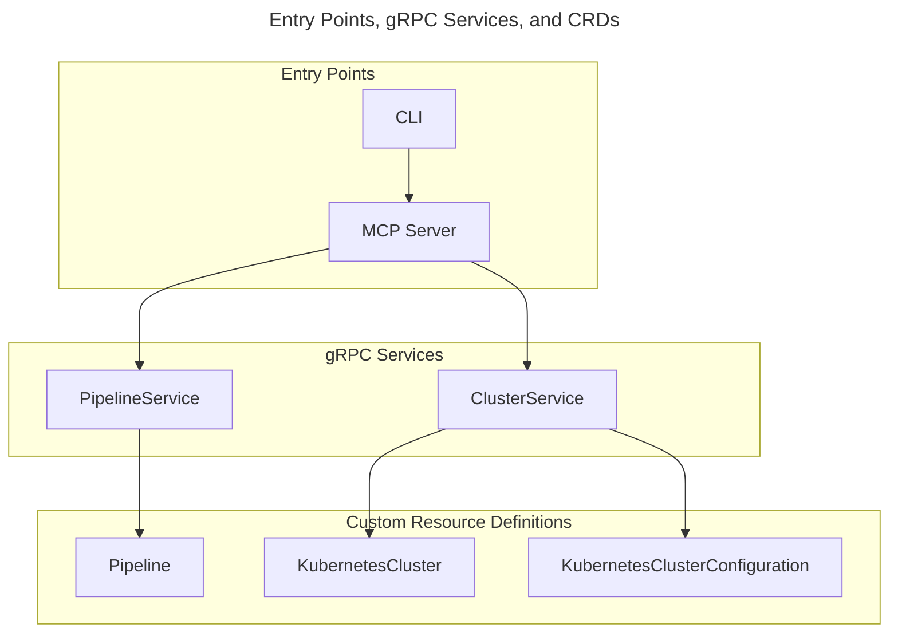
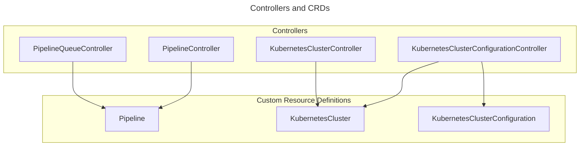

# Design Document

This document describes the design principles and architecture of the kaas-operator-prototype.

## 1. Overview

- Prototype for designing and experimenting with a KaaS (Kubernetes as a Service) controller
- Focus on flexibility, extensibility, and operational ease

## 2. Architecture

### CLI

- Provides a command-line interface for users to interact with the system via gRPC services.

### gRPC Services

The system provides multiple gRPC services that enable external clients to interact with the Kubernetes Custom Resources (CRDs) managed by this project.

- **PipelineService**: Exposes create, read, and update operations for the Pipeline CRD.
- **ClusterService**: Exposes create, read, and update operations for the KubernetesCluster and KubernetesClusterConfiguration CRDs.
- This allows programmatic management and integration with other systems.

> [!NOTE]
> Delete operations may be restricted or handled separately depending on the use case and safety requirements.

### MCP Server

- The MCP (Model Context Protocol) Server acts as a frontend for the gRPC services, accepting requests from external clients.
- The MCP Server routes requests to each gRPC service (e.g., PipelineService, ClusterService) and provides common features such as authentication, authorization, and auditing.
- In the future, it will serve as an entry point for integration and extensibility across multiple KaaS services.

### Kubernetes Controllers

- PipelineQueueController
- PipelineController
- KubernetesClusterController
- KubernetesClusterConfigurationController

### Custom Resource Definitions (CRDs)

- Pipeline
- KubernetesCluster
- KubernetesClusterConfiguration

---

*Details will be added as the project evolves.*
